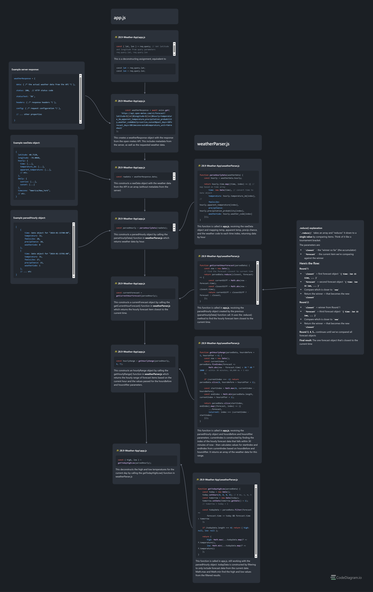

# Weather Dashboard

A clean, interactive weather app that displays hourly forecasts with smooth scrolling and timezone-aware data.


## Features

- **Hourly Forecast**: Scroll through hourly weather data with temperature, conditions, and precipitation probability
- **Geolocation Support**: Automatically detects your location to show relevant weather
- **Timezone Aware**: Correctly displays times regardless of where the app is hosted
- **Day/Night Icons**: Weather icons change based on sunrise/sunset times
- **Interactive Scrolling**: Drag to scroll or use the "Now" button to recenter on current hour
- **Daily Summary**: Shows today's high/low temperatures and sunrise/sunset times
- **Daily Quote**: Displays an inspirational quote powered by ZenQuotes API

## Live Demo

Check out the live version: [Weather Dashboard on CodeSandbox](https://codesandbox.io/p/github/danlang422/weather-app/main)

## Technologies Used

- **Backend**: Node.js, Express
- **Templating**: EJS (Embedded JavaScript)
- **Styling**: CSS with Flexbox
- **APIs**: 
  - [Open-Meteo](https://open-meteo.com/) for weather data
  - [ZenQuotes](https://zenquotes.io/) for daily quotes
- **Icons**: [Weather Icons](https://erikflowers.github.io/weather-icons/)

## Installation

### Prerequisites
- Node.js (v14 or higher)
- npm or yarn

### Setup

1. Clone the repository:
```bash
git clone https://github.com/danlang422/weather-app.git
cd weather-app
```

2. Install dependencies:
```bash
npm install
```

3. Start the development server:
```bash
npm start
```

4. Open your browser and navigate to:
```
http://localhost:3000
```

## How It Works

1. **Location Detection**: The app requests your browser's geolocation
2. **Data Fetching**: Sends your coordinates to the Open-Meteo API to get weather data
3. **Timezone Handling**: Captures your timezone offset to ensure times display correctly
4. **Data Processing**: Parses and structures the hourly forecast data
5. **Display**: Renders the data in a scrollable, interactive interface

## Project Structure

```
weather-dashboard/
├── public/
│   └── main.css           # Styles for the weather interface
├── views/
│   └── index.ejs          # Main template with embedded JavaScript
├── app.js                 # Express server and route handlers
├── weatherParser.js       # Data parsing and weather utilities
├── package.json           # Project dependencies and scripts
└── README.md             # You are here!
```

## Key Learning Moments

This project was built as part of learning web development and includes solutions to several interesting challenges:

- **Timezone Synchronization**: Handling timezone differences between server and client environments
- **API Integration**: Working with real-time weather data from Open-Meteo
- **Interactive UI**: Implementing drag-to-scroll functionality
- **Responsive Design**: Creating a mobile-friendly scrollable interface

## Acknowledgments

- Built as part of [Angela Yu's Complete Web Development Bootcamp](https://www.udemy.com/course/the-complete-web-development-bootcamp/)
- Weather data provided by [Open-Meteo](https://open-meteo.com/)
- Weather icons by [Erik Flowers](https://erikflowers.github.io/weather-icons/)
- Daily quotes from [ZenQuotes](https://zenquotes.io/)
- This ended up being a much more complex project than I anticipated, and I *did* get a decent amount of assistance from Claude in building it, but I spent a lot of time reviewing and researching the code to make sure I really understood how everything works. The biggest challenge, other than the very nuanced manipulation of the data in order to ensure functionality in local and hosted environments, was keeping track of how data passed between app.js and weatherParser.js. Check out the diagram below for some of my documentation on that interaction. 



## License

This project is open source and available under the [MIT License](LICENSE).

## Future Improvements

- [ ] Add 7-day forecast view
- [ ] Save favorite locations
- [ ] Add weather alerts
- [ ] Implement dark mode
- [ ] Add more detailed weather metrics (humidity, wind speed, UV index)

---

Built with ☕ and persistence by Daniel Lang.